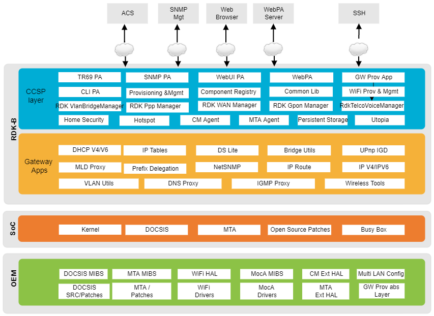

# RDK  learning

<u>（Lcs2021@）</u>

## RDK-B

| profile                | Minimum  RAM | Minimum FLASH |
| ---------------------- | ------------ | ------------- |
| RDB-B Gateway profile  | 1 GB         | 512 MB        |
| RDK-B Extender profile | 512 MB       | 256 MB        |

**RDK_B Architecture**

  

use Yocto SDK

- create program dict

- create `hello.c` , `Makefile.am` and `configure.in`

  - hello.c

    - ```c
      #include <stdio.h>
      main()
      {
      	printf("Hello World!\n");
      }
      ```

  - Makefile.am

    - ```makefile
      bin_PROGRAMS = hello
      hello_SOURCES = hello.c
      ```

  - configure.in

    - ```txt
      AC_INIT(hello.c)
      AM_INIT_AUTOMAKE(hello,0.1)
      AC_PROG_CC
      AC_PROG_INSTALL
      AC_OUTPUT(Makefile)
      ```

- Source the cross-toolchain environment setup file

- Generate file needed by GNU coding standards:

  - `touch NEWS README AUTHORS ChangeLog`

- Cross-compile the project

  - `./configure ${CONFIGURE_FLAGS}`

- make and install the project: These two commands generate and install the project into the destination directory:

  - `make`
  - `make install DESTDIR=./tmp`

- Verify the installation:

  - `file ./tmp/usr/local/bin/hello`

- Execute your projec

  - `./hello`

## RDK-V

- IARM-Bus 与平台无关的IPC通讯接口，允许每个应用相互间发送事件或者远程调用
- Wi-Fi （integrated Wi-fi chips，USB based Wi-Fi adapter）

code download

# 名词缩写

1. **SoC**，系统级芯片
2. **OEM**（Original Equipment Manufacturer）原始设备制造商，或者代工


# Raspberrypi Memory partition in dunfell

image分为两个部分，kernel（~48M）和rootfs（mounted on SD，可以扩容【[Partioning and Resizing using GParted GUI](https://wiki.rdkcentral.com/display/RDK/Partioning+and+Resizing+using+GParted+GUI)】）

#  Yocto配置文件

**User Configuration** 

- （build/config/local.config）

**Machine/BSP Configuration** 

- （BSP added to the BBLAYERS variable in build/conf/bblayers.conf）

- （Machine settings are specified in a layer's conf/machine/xxx.conf）

**Bitbake variables/meta data**‘

- TOPDIR - The build directory
- LAYERIR - Current layer directory
- FILE - Path and filename of file being processed

**Build time meta-data**

- PN - Pakage name ("myrecipe")
- PV - Package version(1.0)
- PR - Package Release (r0)
- P = “${PN}-${PV}”
- PF = “${PN}-${PV}-${PR}”
- FILE_DIRNAME – Directory for FILE
- FILESPATH = "${FILE_DIRNAME}/${PF}:\
- TOPDIR – The build directory
- TMPDIR = “${TOPDIR}/tmp”
- WORKDIR = ${TMPDIR}/work/${PF}”
- S = “${WORKDIR}/${P}” (Source dir)
- B = “${S}” (Build dir)
- D = “${WORKDIR}/${image}” (Destination dir)
- DEPLOY_DIR = “${TMPDIR}/deploy”
- DEPLOY_DIR_IMAGE = “${DEPLOY_DIR}/images”

**Dependency meta-data**

buildtime time package variables

- DEPENDS - Build time package dependencies
- PROVIDES = "${P} ${PF} ${PN}"

Runtime package variables

- RDEPENDS – Runtime package dependencies
- RRECOMMENDS – Runtime recommended packages
- RSUGGESTS – Runtime suggested packages
- RPROVIDES – Runtime provides
- RCONFLICTS – Runtime package conflicts
- RREPLACES – Runtime package replaces

**Common meta-data**

- SUMMARY – Short description of package/recipe
- HOMEPAGE – Upstream web page
- LICENSE – Licenses of included source code
- LIC_FILES_CHKSUM – Checksums of license files at time of packaging (checked for change by build)
- SRC_URI – URI of source code, patches and extra files to be used to build packages. Uses different fetchers based on the URI.
- FILES – Files to be included in binary packages