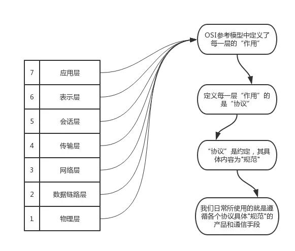

# 计算机网络体系分层结构

**计算机网络体系结构分层**
| OSI七层模型 | TCP/IP概念层模型 | 功能 | TCP/IP协议族 |
| :------: | :--------: | :----: | :---: |
| 应用层 | 应用层 | 文件传输，电子邮件，文件服务，虚拟终端 | TFTP，HTTP，SNMP，FTP，DNS，TeInet |
| 表示层 | 应用层 | 数据格式化，代码转换，数据加密 | 没有协议 |
| 会话层 | 应用层 | 解除或建立与别的节点的联系 | 没有协议|
| 传输层 | 传输层 | 提供端对端的接口 | TCP，UDP |
| 网络层 | 网络层 | 为数据包选择路由 | IP，ICMP，RIP，OSPF，BCP，ICMP |
| 数据传输层| 链路层| 传输有地址的帧以及错误检测功能 | SLIP，CSLIP，PPP，ARP，RARP，MTU |
| 物理层 | 链路层 | 以二进制数据形式在物理媒体上传输数据 | IS02110，IEEE802，IEEE802.2 |
## 协议族基础
**数据包相关单位**
**包、帧、数据包、段、消息**
- 包可以说是全能性术语
- 帧用于表示数据链路层中包的单位
- 数据包是IP和UDP等网络以上的分层中包的单位
- 段则表示TCP数据流中的信息
- 消息是指应用协议中数据的单位 

**数据处理基本流程**
