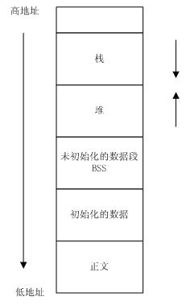

# 函数栈帧
函数对内存使用的分区情况
|区域|作用|
|:-:|:-:|
|栈区（stack）|由编译器自动分配和释放，存放函数的参数值，局部变量的值等。操作方式与数据结构中的栈类似|
|堆区（heap）|一般由程序员分配和释放，若程序员不释放，程序结束时可能由操作系统回收。与数据结构中的堆是两码事，分配方式类似于链表|
|静态区（static）|全局变量和静态变量存放于此|
|文字常量区|常量字符串放在此，程序结束后由系统释放|
|程序代码区|存放函数体的二进制代码|
|栈由系统自动分配，速度较快，在windows下栈是向低地址扩展的数据结构，是一块连续的内存区域，大小是2MB。||
|堆需要程序员自己申请，并指明大小，速度比较慢。在C中用malloc，C++中用new。另外，堆是向高地址扩展的数据结构，是不连续的内存区域，堆的大小受限于计算机的虚拟内存。因此堆空间获取和使用比较灵活，可用空间较大。||
|典型的内存区域分配图||
|||
|寄存器||
|寄存器名称|作用|
|eax|累加（Accumulator）寄存器，常用于函数返回值|
|ebx|基址（Base）寄存器，以它为基址访问内存|
|ecx|计数器（Counter）寄存器，常用做字符串和循环操作中的计数器|
|edx|数据（Data）寄存器，常用作于乘除法和I/O指针|
|esi|源变址寄存器|
|dsi|目的变址寄存器|
|esp|堆栈（stack）指针寄存器，指向堆栈顶部|
|ebp|基址指针寄存器，指向当前堆栈底部|
|eip|指令寄存器，指向下一条指令的地址|

