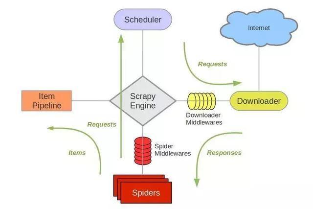

# Scrapy简单使用
## Scrapy简介
Scrapy，Python开发的一个快速、高层次的屏幕抓取和web抓取框架，用于抓取web站点并从页面中提取结构化的数据。Scrapy用途广泛，可以用于数据挖掘、监测和自动化测试.
其最初是为了页面抓取 (更确切来说, 网络抓取 )所设计的， 后台也应用在获取API所返回的数据(例如 Amazon Associates Web Services ) 或者通用的网络爬虫.
Scrapy吸引人的地方在于它是一个框架，任何人都可以根据需求方便的修改。它也提供了多种类型爬虫的基类，如BaseSpider、sitemap爬虫等，最新版本又提供了web2.0爬虫的支持.
### 基本组成
**架构图**

官方架构图

**调度器（Scheduler）**
调度器，说白了把它假设成为一个URL（抓取网页的网址或者说是链接）的优先队列，由它来决定下一个要抓取的网址是 什么，同时去除重复的网址（不做无用功）。用户可以自己的需求定制调度器。
**下载器（Downloader）**
下载器，是所有组件中负担最大的，它用于高速地下载网络上的资源。Scrapy的下载器代码不会太复杂，但效率高，主要的原因是Scrapy下载器是建立在twisted这个高效的异步模型上的(其实整个框架都在建立在这个模型上的)。
**爬虫（spider）**
爬虫，是用户最关心的部份。用户定制自己的爬虫(通过定制正则表达式等语法)，用于从特定的网页中提取自己需要的信息，即所谓的实体(Item)。 用户也可以从中提取出链接,让Scrapy继续抓取下一个页面。
**管道（Item）**
实体管道，用于处理爬虫(spider)提取的实体。主要的功能是持久化实体、验证实体的有效性、清除不需要的信息。
**引擎（Engine）**
Scrapy引擎是整个框架的核心.它用来控制调试器、下载器、爬虫。实际上，引擎相当于计算机的CPU,它控制着整个流程。

## 基本教程
**创建项目**
`scrapy startproject programname`
创建一个`programname`的项目
**`programname`项目包含内容**
```
programname/
    scrapy.cfg          # deploy configuration file

    programename/       # project's Python module, you'll import your code from here
        __init__.py

        items.py        # project items definition file
        middlewares.py  # project middlewares file
        pipelines.py    # project pipelines file
        settings.py     # project settings file
        spiders/        # a directory where you'll later put your spiders
            __init__.py
```
### Spider
spider是定义一个特定站点（或一组站点）如何被抓取的类，包括如何执行抓取（即跟踪链接）以及如何从页面中提取结构化数据（即抓取项）。换言之，spider是为特定站点（或者在某些情况下，一组站点）定义爬行和解析页面的自定义行为的地方。
spider抓取周期：
1. 首先生成一个url进行网络爬虫初始请求，然后指定一个回调函数。
2. 在回调函数中，解析相应（网页）并返回`item object`，`Request`对象，或这些对象的可迭代。这些请求还将包含一个回调函数，并由Scrapy下载，然后指定的回调函数处理它们的相应。
3. 在回调函数中，解析页面内容，通常使用`Selecter`并使用解析的数据生成项。
4. 最后，从spider返回的项目通常会被存储到数据库中。
